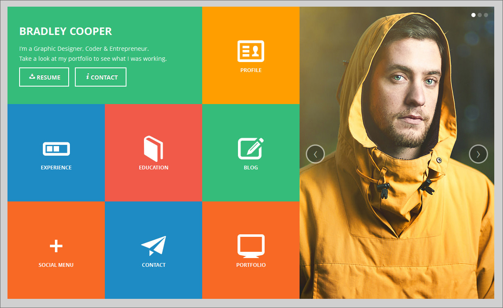

# sh-comp-challenge-1

Our project was to write HTML and CSS that matched the Comp given to us. We needed to make the site responsive and 9 different sections. I took advantage of FlexBox in order to get all of the sections in the right spot, including the picture section on the right hand side with buttons.

